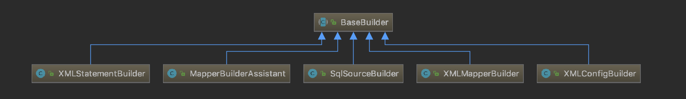

## Java 设计模式

理解 Java 设计模式对理解 JavaWeb 框架比较重要。

学习每种设计模式都要关注其设计思想、类图、应用场景。  
还要关注设计模式之间的关系。  

设计模式通常都不是单独存在的。

设计模式貌似不存在很精确的表述，只是一个大概的样子。

设计模式的核心思想分离经常变化的部分需求到单独的类进行处理。


#### 设计原则（7种）

“少改多拓展，职责单一、面向抽象类和接口编程、多组合少继承、高内聚低耦合”。

+ **开闭原则**（加代码而不是改代码）   

    要求项目上线后对扩展开放，对修改关闭。即拓展业务的时候是增加新的模块代码，而不是修改旧有模块的代码。

    ---

+ **单一职责原则**（类职责单一）

  要求实现类要职责单一，防止某个业务场景的修改影响到其他业务代码。（比如controller、service、dao分开，而不是写到一起）

+ **接口隔离原则**（接口职责单一）

  设计接口的时候要精简单一。

  ---

+ **里氏替换原则**（父类出现的地方都可以替换为子类，子类包含父类所有功能）

  在程序中尽量使用基类类型对对象进行定义，运行时由虚拟机确定其子类类型并替换。

+ **依赖倒置原则**（和里氏替换类似，用接口替换实现类）

    面向接口编程不是面向实现编程。代码调用处使用接口类调用功能而不是通过具体的实现类调用功能。

    ---

+ **合成复用原则**（尽量使用组合而不是继承）

+ **迪米特法则**（最少知道原则）

    类与类之间要高内聚低耦合。

    

#### 创建型模式

+ **singleton 单例模式**

    单例模式的特点:

    1) 构造器私有，不允许手动new对象；

    2）静态成员变量；

    3）提供一个公开静态访问方法，获取单例对象。

    比较多用的DCL+volatile单例模式。

    拓展问题：

    1）为什么饿汉式单例是线程安全的？

    ​	因为饿汉单例在用获取单例对象的方法获取单例时，单例对象已经被创建得到的总是同一个对象实例。​而第一次被调用获取单例方法加载对象的时候，JVM也是会对加载对象的线程进行加锁。

+ **simpleMethod 简单工厂模式**

    解决的问题：类构造细节复杂，通过简单工厂封装掩盖实现细节。

+ **factoryMethod 工厂方法模式**

    用于优化简单工厂，简单工厂创建对象前，要判断创建哪种对象。这个工厂负责的产品总类多，内部实现复杂。

    工厂方法模式的优化思想是“专品专厂”，为每种产品创建一个工厂。我们先创建它的专属工厂，然后看需要哪种产品就用对应的工厂创建具体的对象实例。

+ **abstractFactory 抽象方法模式**

    针对产品内部有细分组件的场景（产品族，比如一辆车有轮胎，发动机，座椅等）。

    现在还是

     

+ **builder 建造者模式** (分离建造过程和表示[图纸]，类似多功能流水线)

    > The Builder is a design pattern designed to provide a flexible solution to various object creation problems in object-oriented programming.   
      The intent of the Builder design pattern is to separate the construction of a complex object from its representation.

    建造者模式使用简单的对象一步步生成复杂的对象；

    个人感觉就像一条多功能流水线（如一条可以组装各种车型的造车流水线，或一条组装各种电脑的流水线，或者汉堡店套餐制作流水线）；
    分别对标 [维基百科案例](https://en.wikipedia.org/wiki/Builder_pattern)，本工程的案例，[runoob.com的案例](https://www.runoob.com/design-pattern/builder-pattern.html)。

    建造者模式一般包含以下几部分：

    - 建造指导思想 （IComputerBuilder） 
        决定我们要造什么，大概的流程。代码中通常是一个接口。
        比如：我们要造车而不是造电脑，造车大概流程：造汽车骨架，发动机，油箱，座椅，控制系统等等；

    - 建造图纸 (MacBuilder XiaomiBuilder)
        设计工程师根据老板的指导思想设计几种车型的详细的建造方案，包括汽车大小，组件选型，成本预算等等。
        
    - 建造组件 (Box Cpu HardDisk Memory MotherBoard Power)
        车骨架、发动机、油箱、座椅、控制系统等等。  
        建造组件不一定是一成不变的，每种组件也可能分为好多类。

    - 流水线（Director）
        拿着图纸规划进行生产的组装流水线。

    实际案例：

    - Web框架中的Builder

        * Mybatis 中 Builder
        
            
        
            这里的几个Builder实现类除了建造组件都是Configurations等配置数据，
            没有统一的指导思想和共用的流水线；每个Builder有自己的生产线 parse()。
            
            感觉并不是Builder模式，因为建造过程(parse())和表示(XMLXxxBuilder)没有分离；而且这里的场景，
            建造过程并不通用。

+ **prototype 原型模式**

    原型模式就是对象复制。复制分为深复制和浅复制。

    - 浅复制

      实现Clonable接口（只是标示接口），只需要调用Object类的clone方法（调用的native方法）；

      只将对象的基本类型和String类型进行复制，其他引用类型对象不会复制（直接copy内存地址）

      ```java
      public class User implement Clonable {
          //成员
          private String Name;
          private Info info;
          //浅复制方法
          public Object shallowClone() throws CloneNotSupportedException {
          	User user = (User)super.clone();
          	return user;
          }
      }
      
      //浅复制
      User user = new User();
      User newUser = (User)user.shallowClone();
      ```

    - 深复制

      1) 实现Serializable接口（只是标示接口），调用对象字节序列化流。

      主要就是将对象读到字节流，然后再把字节流内容读成对象的过程。

      ```java
      public class User implement Serializable {
          //成员
          private String Name;
          private Info info;
          //深复制方法
          public Object deepClone() throws IOException, ClassNotFoundException {
              ByteArrayOutputStream bos = new ByteArrayOutputStream();
              ObjectOutputStream oos = new ObjectOutputStream(bos);
              oos.writeObject(this);
              ByteArrayInputStream bis = new ByteArrayInputStream(bos.toByteArray());
              ObjectInputStream ois = new ObjectInputStream(bis);
              return ois.readObject();
          }
      }
      
      //深复制
      User user = new User();
      User newUser = (User)user.deepClone();
      ```

      2) 某个类所有成员对象类包括成员对象类的成员对象类一层一层深入全部实现Clonable接口也是可以实现深度复制的。

#### 结构型模式

+ **adapter 适配器模式**

+ bridge 桥接模式

+ composite 组合模式

+ **decorator 装饰模式**

+ facade 外观模式（门面模式）

    要求一个子系统的外部与其内部的通信必须通过一个统一的对象。
    okhttpClient就是使用的门面模式。okhttpClient包含了post，url等对象。

    Slf4j 中使用的是外观模式，不是代理模式。
    
    Facade外观模式、proxy代理模式、mediator中介者模式的区别：

+ flyWeight 享元模式

+ **proxy 代理模式**

    代理模式解决的问题：  
    
    将目标类不擅长的工作交给代理类去做；  
    对于模版性的代码，可以交给代理模式去做；  
    为了不修改原来代码的情况下，进行代码增强。  
    
    常用动态代理方式： 
    
    - Jdk
      
        针对带有接口的类进行动态代理
    
    - Cglib
    
        使用继承的方式进行代理（目标类是父类，代理类是子类）

    代理模式分类：  
    
    - 静态代理
    
        代理对象保持被代理对象的引用，代理对象的方法调用被代理对象的方法。  
        静态代理不方便业务拓展，被代理对象拓展了业务，代理对象的代码也要响应的做出修改。
    
    - 动态代理（针对上面问题的改进型）  
      
        使用反射的机制生成一个继承被代理类的动态代理类，然后使用这个生成的动态代理类
        实现业务逻辑。
        
        动态代理的原理（字节码重组）：  
        1 拿到被代理对象的引用，并且反射获取它的所有接口  
        2 JDK Proxy 重新生成一个新的类，同时新的类要实现被代理类所有实现方法（方法内部还是通过反射调用愿对象的方法）  
        3 动态生成Java代码，把新加的业务逻辑方法由一定的逻辑代码去调用  
        4 重新编译新生成的Java代码.class （com.sun.proxy.$Proxy0 这个是运行时动态生成的，可以通过反编译工具查看代码）
        5 再重新加载到JVM中运行
        
        相对于静态代理优势：    
        动态代理避免了接口修改的时候造成的代理类的修改；  
        动态代理可以代理大量不同种类的对象，静态代理只能代理一种类型的对象。
    
    动态代理和静态代理最大的不同：静态代理在代理之前需要知道被代理对象所有的信息（通常是持有被调离对象的实例引用）；
    而动态代理不需要知道被代理类的信息，而是代理时通过反射获取被代理对象的信息（可以使用JDK反射或者使用CGLib实现）。
    
    代理模式的优点：
    
    - 解耦
    
    代理模式使用案例：  
    
    - Spring AOP
    - 拦截器 
    
    Spring AOP 代理实现原理？

#### 行为型模式

+ visitor 访问者模式

+ **template 模板模式**

    业务流程固定，但是业务的每一步有些许变化。

    使用案例：

    - Spring 中众多的Template, 如：JdbcTemplate、RedisTemplate etc

+ **strategy 策略模式**（实现最终目的的方式有多个，但我们不是根据名称选择具体的方法，而是直接选择实现方式的类调用其方法）

    方便拓展策略而不影响现有代码。

    应用场景：  
    根据用户需求处理数据的时候需要对算法（算法类型固定不变）做出选择；  
    比如条条大路通罗马，大路的走向和条数基本不变，就可以使用策略模式实现旅行规划。  
    又比如：网上购物有三种支付方式，微信支付，支付宝支付，银联卡支付，也可以使用策略模式实现。  
    登录方式。

    使用策略模式应该注意如何保证策略的易拓展性；推荐使用 Enum 。  
    使用策略模式，以后面对上面类似场景就再也不用 switch 和 if else 了。  

    使用案例：

    - 比较器 Comparator
      
        ```
        new ArrayList<String>().sort(new Comparator() { //重新定义一种比较策略
            @Override
            public int compare(String str1, String str2) {
                return str1.compareTo(str2)；
            }
        });
        ```
        
    - Spring 创建 Bean 时选择 BeanFactory 类型

+ state 状态模式

+ **observer 观察者模式**

    感觉应该说是”通知模式“，因为实现都是“观察者”不主动观察监听，而是告诉“被监听者”说我是你的观察者，

    来事了记得通知我处理（被监听者拥有观察者的对象引用，来事就通过此饮用调用处理方法）。

+ memento 备忘录模式

+ mediator 中介者模式

+ iterator 迭代器模式

+ interpreter 解释器模式

+ **command 命令模式**

+ chainOfResponsibility 责任链模式（请求和处理解藕，请求不做判断直接丢给处理者，处理者判断能不能处理，然后传给其他处理者）

    [使用责任链优化前后对比的案例--采购部采购审批](https://blog.csdn.net/justloveyou_/article/details/68489505)

    Web框架中这种模式的应用还是挺多的。

    责任链模式讲的就是将请求的发送者和接收者进行分离，避免请求发送者与接收者耦合在一起，让多个对象都有可能接收请求，将这些对象连接成一条链，
    并且沿着这条链传递请求，直到有对象处理它为止，面对需求变更，只需要更加处理类就好了，而且客户端可以按照自己的需求拼接处理链条。  
    (每个处理器是链表的一个节点，所有处理器连成一条链，请求从第一个处理器开始处理(处理器内部决定要不要处理这个请求))。

    优点：  
    责任链模式将请求和处理分开，请求者不知道是谁处理的，处理者可以不用知道请求的全貌。  
    提高系统的灵活性。  

    缺点：  
    降低程序的性能。每个请求都是从链头遍历到链尾，当链比较长的时候，性能会大幅下降。  
    不易于调试。由于该模式采用了类似递归的方式，调试的时候逻辑比较复杂。

    使用限制：
    被处理的对象的处理模式固定，如果每次来的对象的处理方式经常变就不适合用责任链，不然每次都要添加新的处理器节点，还降低性能。

    使用案例：

    - Spring MVC Filter/Interceptor，Spring Security 的认证链
    - Netty 的 ChannelHandler 应该也是

#### 其他模式

+ 委派模式   
+ MVC模式（架构型设计模式）

